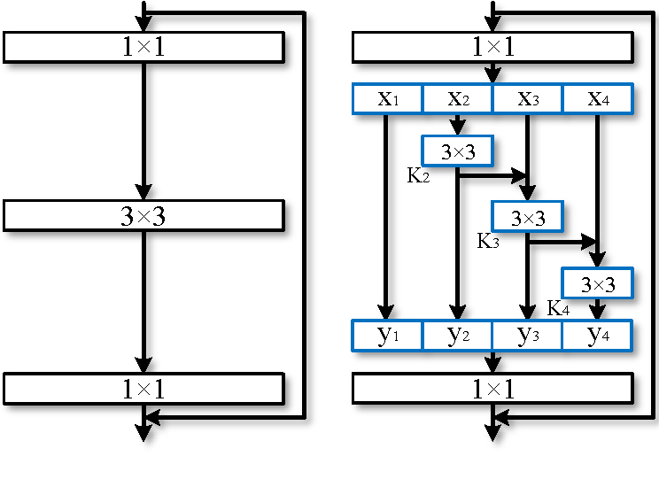

# Res2Net
The official pytorch implemention of the paper ["Res2Net: A New Multi-scale Backbone Architecture"](https://arxiv.org/pdf/1904.01169.pdf)

Our paper is accepted by **IEEE Transactions on Pattern Analysis and Machine Intelligence (TPAMI)**.
## Introduction
We propose a novel building block for CNNs, namely Res2Net, by constructing hierarchical residual-like
connections within one single residual block. The Res2Net represents multi-scale features at a granular level and increases the range
of receptive fields for each network layer. The proposed Res2Net block can be plugged into the state-of-the-art backbone CNN models,
e.g. , ResNet, ResNeXt, BigLittleNet, and DLA. We evaluate the Res2Net block on all these models and demonstrate consistent performance gains over baseline models.
<p align="center">
	
	<p align="center">
		<em>Res2Net module</em>
	</p>
</p>

## Useage
### Requirement
PyTorch>=0.4.1 (PyTorch1.0 and 1.1 are supported.)
### Examples 
```
git clone https://github.com/gasvn/Res2Net.git

from res2net import res2net50
model = res2net50(pretrained=True)

```
Input image should be normalized as follows:
```
normalize = transforms.Normalize(mean=[0.485, 0.456, 0.406],
                                  std=[0.229, 0.224, 0.225])
```
(By default, the model will be downloaded automatically.
If the default download link is not available, please refer to the Download Link listed on **Pretrained models**.)
## Pretrained models
| model |#Params | GFLOPs |top-1 error| top-5 error| Link |
| :--: | :--: | :--: | :--: | :--: | :--: |
| Res2Net-50-48w-2s  | 25.29M | 4.2 | 22.68 | 6.47 |[OneDrive](https://1drv.ms/u/s!AkxDDnOtroRPbo7RnRUz-7ejhLg?e=gU2EZG)
| Res2Net-50-26w-4s  | 25.70M | 4.2 | 22.01 | 6.15 |[OneDrive](https://1drv.ms/u/s!AkxDDnOtroRPbMavn7eawKhvCPY?e=TBHOuT)
| Res2Net-50-14w-8s  | 25.06M | 4.2 | 21.86 | 6.14 |[OneDrive](https://1drv.ms/u/s!AkxDDnOtroRPdOTqhF8ne_aakDI?e=EVb8Ri)
| Res2Net-50-26w-6s  | 37.05M | 6.3 | 21.42 | 5.87 |[OneDrive](https://1drv.ms/u/s!AkxDDnOtroRPc2mqy1h8324sxxI?e=Go4p7I)
| Res2Net-50-26w-8s  | 48.40M | 8.3 | 20.80 | 5.63 |[OneDrive](https://1drv.ms/u/s!AkxDDnOtroRPdTrAd_Afzc26Z7Q?e=slYqsR)
| Res2Net-101-26w-4s | 45.21M | 8.1 | 20.81 | 5.57 |[OneDrive](https://1drv.ms/u/s!AkxDDnOtroRPcJRgTLkahL0cFYw?e=nwbnic)
| Res2NeXt-50        | 24.67M | 4.2 | 21.76 | 6.09 |[OneDrive](https://1drv.ms/u/s!AkxDDnOtroRPcWlWLXBuKxma7DQ?e=mt4dQf)
| Res2Net-DLA-60     | 21.15M | 4.2 | 21.53 | 5.80 |[OneDrive](https://1drv.ms/u/s!AkxDDnOtroRPbWAqdcatece24vs?e=t3shXH)
| Res2NeXt-DLA-60    | 17.33M | 3.6 | 21.55 | 5.86 |[OneDrive](https://1drv.ms/u/s!AkxDDnOtroRPcjxCM0kAYHEaEd0?e=9WrBpj)

#### News
- Pretrained models are hosted on new servers [Download link](http://data.kaizhao.net/projects/res2net/index.html). You can load 
the pretrained model by using `pretrained = True`.

The download link from Baidu Disk is now available. ([Baidu Disk](https://pan.baidu.com/s/1BP7X222ZPqOndbojwOPjkw) password: **vbix**)
## Applications
Other applications such as Classification, Instance segmentation, Object detection, Semantic segmentation, Salient object detection, Class activation map,Tumor segmentation on CT scans can be found on https://mmcheng.net/res2net/ .

## Citation
If you find this work or code is helpful in your research, please cite:
```
@article{gao2019res2net,
  title={Res2Net: A New Multi-scale Backbone Architecture},
  author={Gao, Shang-Hua and Cheng, Ming-Ming and Zhao, Kai and Zhang, Xin-Yu and Yang, Ming-Hsuan and Torr, Philip},
  journal={IEEE TPAMI},
  year={2020},
  doi={10.1109/TPAMI.2019.2938758}, 
}
```
## Contact
If you have any questions, feel free to E-mail me via: `shgao(at)live.com`
